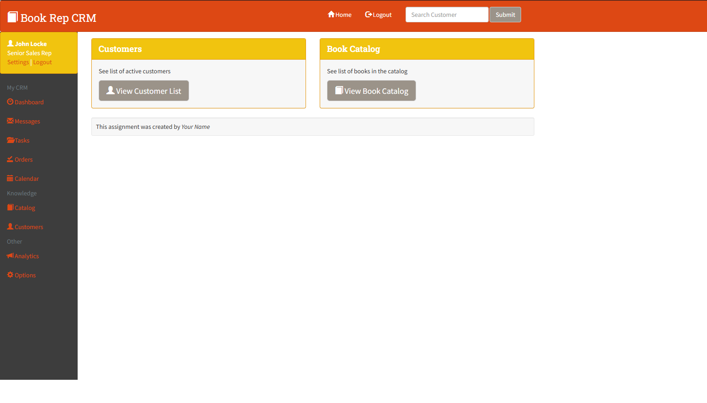

📚 Book Management System
A Dynamic Web Application for Managing Books

📜 Description
The Book Management System is a PHP-based web application that allows users to manage books, customers, and transactions efficiently. It uses MySQL for database management and supports a user-friendly interface with Bootstrap styling.

🚀 Features
✅ Book Management – Add, edit, and delete books
✅ Customer Management – Manage customer records
✅ Dynamic Web Pages – Uses PHP for server-side logic
✅ Database Integration – MySQL-powered book catalog
✅ Bootstrap UI – Clean and responsive design

🛠️ Technologies Used
PHP (Server-side processing)
MySQL (Database)
Bootstrap (Front-end framework)
Apache (EasyPHP) (Local server for testing)
🔧 Installation & Setup
1️⃣ Install EasyPHP (or XAMPP)
If you don’t have EasyPHP, download and install it:
🔗 EasyPHP DevServer

## 📸 Screenshots

### 🏠 Home Page

2️⃣ Clone the Repository
bash
Copy
Edit
git clone https://github.com/Mustafa22J/Book_Management_System.git
or manually move the project to:

bash
Copy
Edit
C:\Program Files (x86)\EasyPHP-DevServer-14.1VC9\data\localweb\
3️⃣ Import the Database
Open phpMyAdmin (http://127.0.0.1/phpmyadmin)
Create a new database: bookcrm
Import the bookCRM-vers.sql file
4️⃣ Run the Application
Start EasyPHP DevServer
Open your browser and go to:
http://127.0.0.1/Book_Management_System/index.php
📂 Project Structure
python
Copy
Edit
Book_Management_System/
│── bootstrap3_bookTheme/    # UI Styling
│── images/                  # Book cover images
│── includes/                # PHP includes (header, footer, database)
│── .settings/               # IDE settings (Eclipse)
│── Database-Setup_EasyPHP.docx  # Setup guide
│── book-list.php            # Displays available books
│── book-details.php         # Book information page
│── customer-list.php        # List of registered customers
│── index.php                # Main landing page
│── bookCRM-vers.sql.zip     # Compressed database dump
🎯 Future Improvements
🔹 Add search functionality for books & customers
🔹 Implement user authentication (Admin/User roles)
🔹 Integrate AJAX for dynamic updates

📜 License
This project is open-source and can be used for educational purposes.

✨ Contributions & Support
Got ideas for improvements? Fork, contribute, and submit a PR!
If you need help, feel free to open an issue on GitHub!
